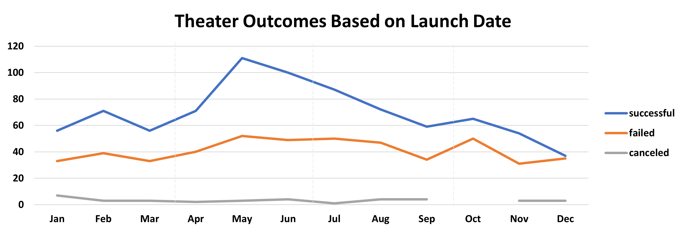
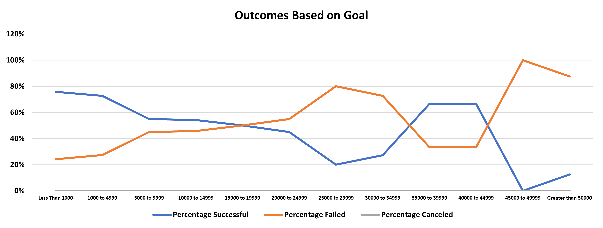

# **Analysing crowdfunding data to determine factors that could impact successful campaigns**
## **Why this project:**
* On this project, I helped an up-and-coming playwright who wanted to start a crowdfunding campaign to fund her play which she estimated a budget of over $10k. I will be identifying trends that lead campaigns to be successful, to be canceled or failed. To accomplish this, I sorted, organized, and analyzed crowdfunding data in excel, using pivot tables, pivot graphs, conditional formatting, and doing statistic analysis. Finally, the analysis is focused on Theaters and Plays campaigns.
## **Analysis:**

### Lanch Date importance:
- 34% of all *successful* campaigns began in the second quarter, followed with a 26% in the third quarter.
- The graphic shows a significant increase in *failed/canceled* campaigns that were launched at end of the year. Only the 56% of the campaigns launched in Q4 where *successful*.
- Finally, even though the number of *failed/canceled* campaigns is higher in Q2, they only represent a 35% of the total launched campaigns in that quarter. 

### Plays' Campaigns Goals impact on Outcomes:
- Campaigns whos goal was between $5.000 to $24.999 had an average of 50% *success* rate. 
- Campaigns whos goal was between $25.000 to $34.999 and $45.000 or greater had an average of 85% *failed* rate. 
- There were no canceled plays, all plays' campaigns were either successfull or failed.

## **Limitations and Recommendations:**

- There is no relation between the campaigns' goal amount and the outcome. There are campaigns whose goal was more than $35K but less than $45k and had a 67% *successful* rate. For this reason, it is important to analyse more factors that can support this relation e.g., *The number of campaigns per goal range, duration, etc.*.  
- Furthermore, it is important to include statistical analyses to identify any outliers that could be significantly impacting the data i.e., adding a *Box Plot* to display the variation of the data. Also, add a *Geographical Map Chart* to analyze the amount of backer per region and the avg donation.
- I'd recommend getting her play's budget reduced considering that the 75% of the successful campaigns had a goal of $5.000 or less and the mean pledged is $5.602. 
- If a budget reduction is not possible, I'll advise to analyze those campaigns who are within the fourth quartile and see more detailed factors like the campaign characteristics, length of the campaigns, etc.

